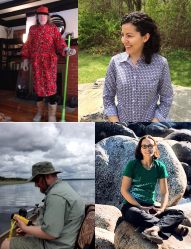
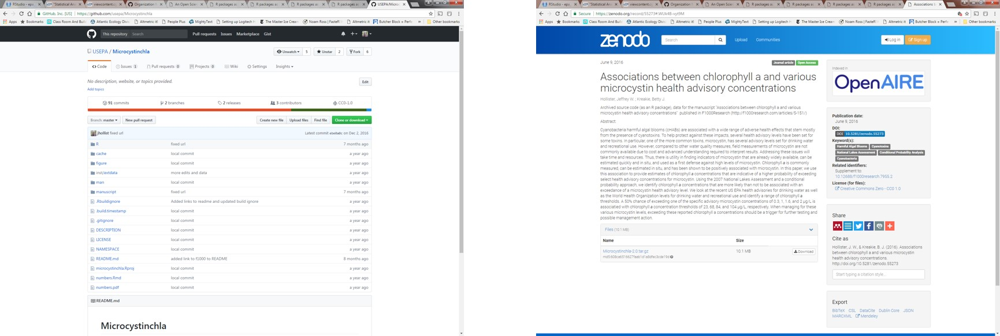

class: center, middle, inverse

```{r setup, include=FALSE, message=FALSE}
options(htmltools.dir.version = FALSE)
library(lakemorpho)
library(elevatr)
data(lake)
data(pt_df)
```

class: center, middle, inverse

# Who and what?

---

# Who are we?

.left-column[
- Ecologists 
- Computational focus
  - Enough to be dangerous
- 3 FTE
  - Myself
  - Betty Kreakie
  - Bryan Milstead
- 2 Post-docs
  - Farnaz Nojavan
  - Stephen Shivers
]

.right-column[
</img>
]

---

# What do we do? 

- Apply computational approaches to understand water quality impacts in lakes
  - Modelling 
  - Open Data
  - New tooling
- SSWR 4.01C: A Data Intensive Investigation of Temperature Impacts and Bloom Modelling


---
class: center, middle, inverse

# Packages

=======

---
class: center, middle, inverse

# Packages

---

# Why Packages

- Useful structure
- Infrastrcutre for sharing
  - GitHub
  - CRAN
- We are an R shop!

---
# Research Compendia

.left-column[
- Define
- Origins
  - [Gentleman and Lang (2004)](http://biostats.bepress.com/bioconductor/paper2)
- Part of
  - Reproducible Research
  - Literate Programming
- ROpenSci efforts
  - [rrrpkg](https://github.com/ropensci/rrrpkg)
  - [ROpenSci unconf 2017 discussion](https://github.com/ropensci/unconf17/issues/5)
]

.right-column[


image credit: N&Uumlst, Konkol, et al (2017), https://doi.org/10.1045/january2017-nuest
]

---

# Packages as Research Compendia
- R, Data, and Vignettes folders
- Other examples
- Our examples
     - https://github.com/usepa/LakeTrophicModelling
     - https://github.com/usepa/Microcystinchla)
- GitHub and Zenodo (Archive)



---

# Packages to solve common problems
  - `lakemorpho`
  - `elevatr`
  - `lakescape` (in development)
  
</img>
---

# `lakemorpho`

.footnote[Package URL: <https://cran.r-project.org/package=lakemorpho>]

.left-column[
- Lake morphometry metrics in R
- Version 1.0 
  - August 2014
- Version 1.1.0 
  - December 2016
- `sf` support to be added
- [National Lake Morphometry](https://edg.epa.gov/metadata/catalog/search/resource/details.page?uuid=%7B495CBAED-9BB9-49B4-80A7-1C91DE5FCA95%7D)
- [Hollister and Milstead (2010)](http://dx.doi.org/10.1080/07438141.2010.504321)
- [Hollister *et. al.* (2011)](http://dx.doi.org/10.1371/journal.pone.0025764)
- [Hollister and Stachelek (In Review)]()
]

.right-column[
```{r, echo=FALSE, message = FALSE}
set.seed(1)
library(lakemorpho)
data(lakes)
plot(inputLM)
```
]


---
class: center, middle
background-image: url('figure/lakemorpho_demo.png')
background-position: 50% 50%

<!-- # [lakemorpho: Demo](http://server.jwhollister.com:8787) -->


---

# `elevatr`

.footnote[Package URL: <https://cran.r-project.org/package=elevatr>]

.left-column[
- Access elevation data in R
  - Mapzen
  - AWS
  - USGS
- Version 0.1.1 
  - January 2017
- Version 0.1.3 
  - March 2017
- Will be paired with `lakemorpho`
- `sf` support to be added
]

.right-column[
```{r, echo=FALSE, message = FALSE, cache = TRUE}
set.seed(1)
raster::plot(get_elev_raster(lake,z = 12))
```
]


---
class: center, middle
background-image: url('figure/elevatr_demo.png')
background-position: 50% 50%

<!-- # [elevatr: Demo](http://server.jwhollister.com:8787) -->

---

# `lakescape`

- New effort with Bryan Milstead
- Summarizes ancillary data for land area around lake
  - Census (via `censusapi`)
  - Landscover
  - Impervious
- Accepts arbitrary spatial data for "lakescape"
- Based on `sf` and tidy by design
- <https://github.com/willbmisled/lakescape>

---

# Thanks!
.center[
## Jeff Hollister
US EPA </br>
Atlantic Ecology Division </br>
Narragansett, RI </br>
email: [hollister.jeff@epa.gov](mailto:hollister.jeff@epa.gov) </br>
twitter: [@jhollist](https://twitter.com/jhollist) </br>
github: [jhollist](https://github.com/jhollist) </br>


Slides created via the R package [**xaringan**](https://github.com/yihui/xaringan).
]


